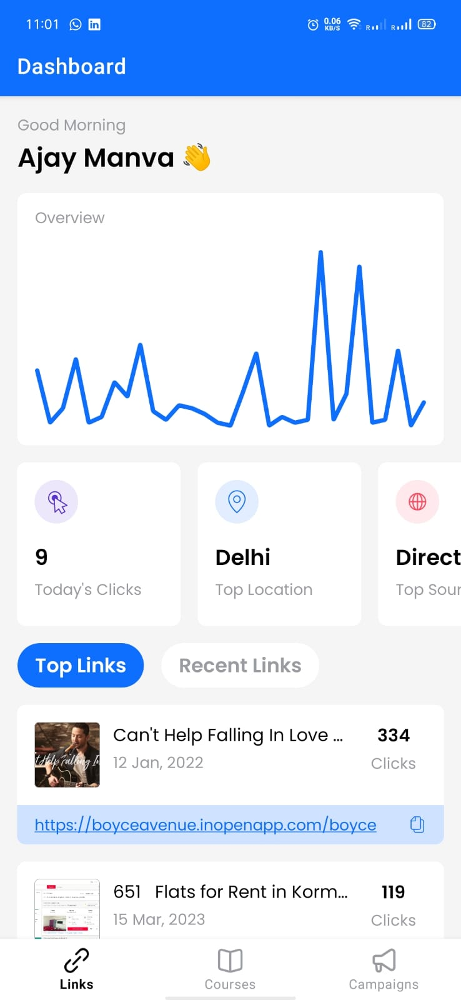
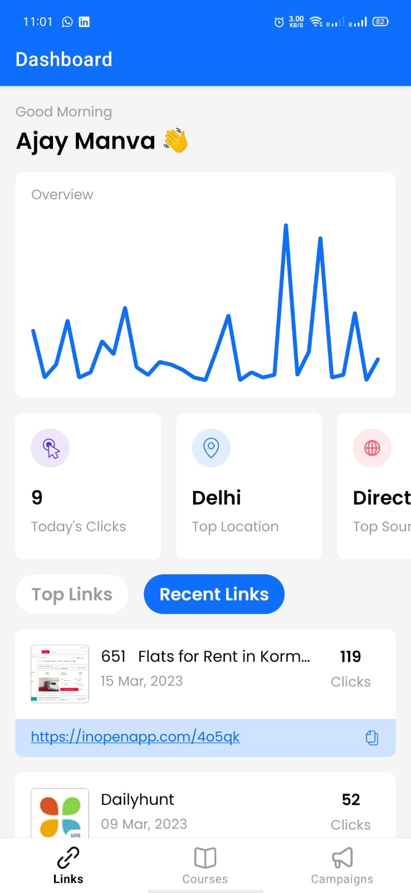

# Openin App Assignment

I had to create a single page for an app using Native Android (Kotlin) and MVVM desgin pattern. We had to follow the [Figma](https://iOS.openinapp.co/UITemp) designs, while creating the UI of the app. Following is the UI that I created inside the app.

  
  

## Design Pattern & Libraries

I have tried to make the app as scalable as it can be, following the best industry practices for creating large scale apps.

1. **MVVM + Clean Architecture** - Used this design pattern, separating out each are of concern into separate files. Made use of SOLID principles to make app more testable and extensible. It would be easier to manage and build such an app with a big team as well.
2. **Jetpack** - Used [Jetpack Navigation](https://developer.android.com/jetpack/androidx/releases/navigation) for the bottom navigation part.
3. **Retrofit** - [Retrofit](https://square.github.io/retrofit/) library is used for making API calls.
4. **Hilt** - [Hilt](https://developer.android.com/training/dependency-injection/hilt-android) for android, is used for dependency injection, making the app more testable.
5. **Spark** - This is the package I used for showing the line graph in the app. [Spark](https://github.com/robinhood/spark) is a lightweight library created for showing simple line graphs just to represent a trend.
